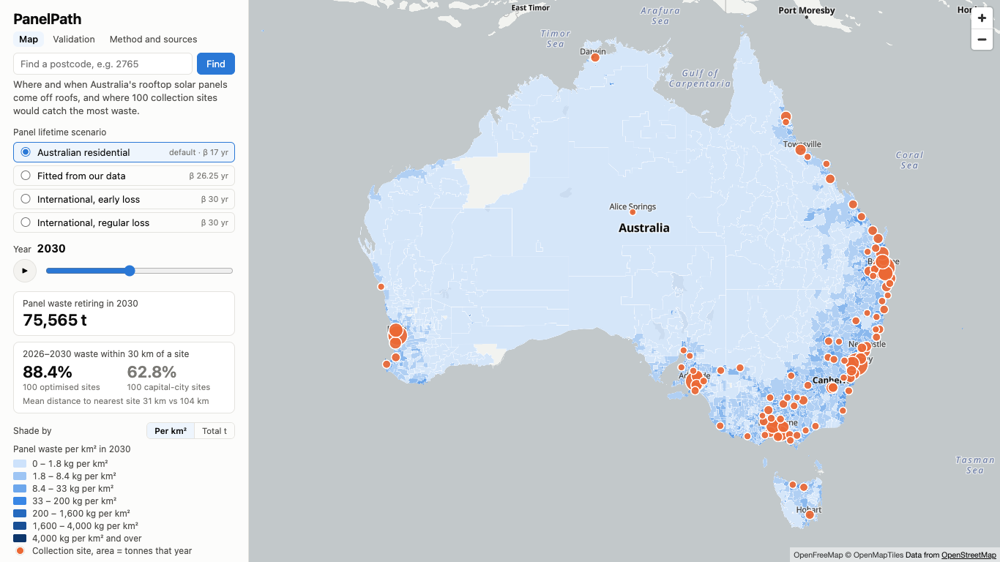
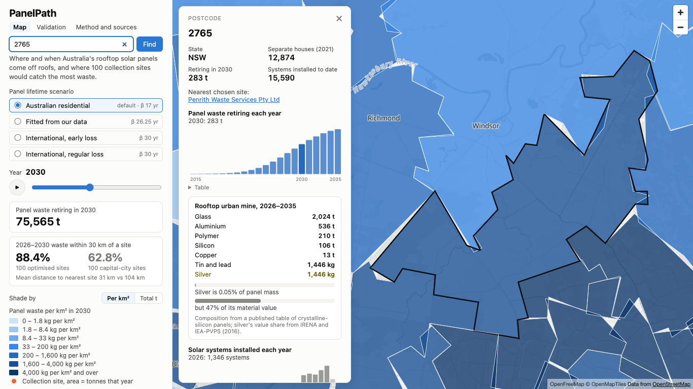
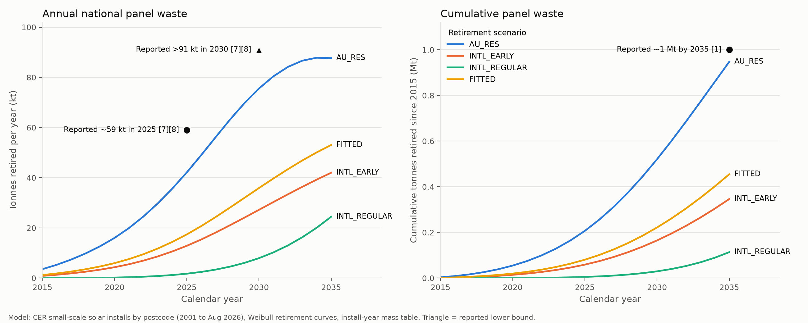
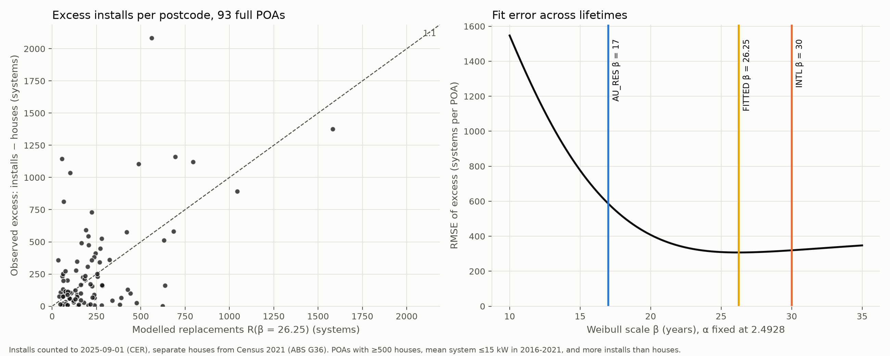

# PanelPath

**Where and when Australia's rooftop solar panels will come off roofs, and where 100 collection sites would catch the most of them.**

PanelPath forecasts end-of-life solar panels postcode by postcode, measures how long panels really last from installation data, and chooses collection sites for the stalled national recycling pilot. It is our entry for Climate Hack-tion 2026, track Green Industrialisation.



**Live site:** https://josephks10.github.io/PanelPath/ (built and published by `.github/workflows/pages.yml` on every push to `main`).

## The problem

- **A waste wave is coming.** Around 1 million tonnes of solar panels, roughly 50 million panels, are expected by 2035 [1]. More than 4.3 million Australian homes have rooftop solar [4].
- **Most of it isn't recycled.** About 17% of panels are recycled today, and a recycler told a Senate committee the average decommissioned panel is only about eight years old [7]. Recycling costs about $28 a panel against $4.50 to landfill [10], and no national dataset tracks where panels go [2].
- **The fix is stalled.** The $24.7M national pilot, meant to collect up to 250,000 panels from about 100 sites, was announced in January 2026 [1][6]. Procurement was suspended in May and was still suspended in September [3][5][6].

**Who it is for.** Whoever restarts the pilot, and DCCEEW, deciding where up to 100 sites go and how much each will handle. Also state schemes (NSW is drafting regulation, WA has committed $13M [6][9]), councils deciding whether to host a drop-off, and recyclers planning feedstock.

**COP31 alignment.** The COP31 Action Agenda targets a global circular material use rate of at least 15% by 2035 [29]. Panels can only be recycled if they are collected first, and PanelPath turns the collection network into a concrete plan, with the recoverable materials counted.

## What it does

1. **Forecasts waste by postcode.** Clean Energy Regulator registrations (4.53 million systems and 30.6 GW since April 2001) are turned into monthly install cohorts. Each cohort becomes panels and tonnes using an install-year mass table, and retires along a Weibull curve. The result is tonnes retiring in every one of 2,641 postcodes, every year from 2015 to 2035, under four lifetime scenarios.
2. **Measures panel lifetimes from data.** Where a postcode has more installs than houses, the excess is replacements. Fitting that excess gives a lifetime from Australian data instead of an assumed one.
3. **Chooses collection sites.** From 2,488 Geoscience Australia transfer stations, council tips and e-waste drop-offs, a covering algorithm picks 100 sites, at least two per state, that put the most 2026–2030 waste within 30 km.
4. **Counts the urban mine.** Each postcode and site shows its glass, aluminium, silicon, copper, silver, and tin and lead.



## Key results

| Result | Value |
|---|---|
| National panel waste, `AU_RES` (default) | 42.1 kt in 2025 and 75.6 kt in 2030; 0.95 Mt and 50.6M panels from 2015 to 2035 |
| Against reported figures | 0.71× the reported ~59 kt (2025), 0.83× the reported >91 kt (2030), 0.95× ~1 Mt and 1.01× ~50M panels (2035) |
| Collection coverage, 100 sites, 2026–2030 waste within 30 km | **88.4% optimised vs 62.8% capitals-only** |
| Mean distance to the nearest site, weighted by tonnes | 31 km optimised vs 104 km capitals-only |
| Greedy against the exact optimum (CBC) | 99.4% of the optimum (88.9% coverage) |
| Robustness | The fitted-lifetime scenario picks the same 100 sites |
| Lifetime fitted from data | β = 26.25 years from 93 postcodes; every sensitivity run gives 24.75 to 26.75 |
| Rooftop urban mine, 2026–2035, `AU_RES` | 518 kt glass, 137 kt aluminium, 27 kt silicon, 3.3 kt copper, 370 t silver |

## Run it

Requires Python 3.11 and Node 22.

```bash
python3.11 -m venv .venv && source .venv/bin/activate && pip install -r requirements.txt
python -m pipeline.download          # about 160 MB of raw data into data/raw/, recorded in MANIFEST.json
python -m pipeline.run --stage all   # about 45 s; writes data/interim, data/processed and web/public/data
pytest -q                            # 15 tests
cd web && npm install && npm run dev # the map on http://localhost:5173 (npm run build for the static site)
```

The processed outputs are committed, so `cd web && npm install && npm run dev` works without running the pipeline.

| Stage | Module | Writes |
|---|---|---|
| `clean` | `clean_cer.py` | `data/interim/cer_installs.parquet`: installs and kW per postcode and month |
| `geography` | `geography.py` | `data/interim/poa.parquet` (state, centroid, area, capital flag, houses) and the web polygons |
| `cohorts` | `cohorts.py` | `data/interim/cohorts.parquet`: panels and tonnes per cohort |
| `fit` | `replacement_fit.py` | `data/processed/fit_report.json` and `outputs/figures/fit_excess_vs_model.png` |
| `retire` | `retirement.py` | `data/processed/retirements.parquet`: panels and tonnes per scenario, postcode and year |
| `optimise` | `optimiser.py`, `facilities.py` | `data/processed/sites_<scenario>.geojson` and `coverage.json` |
| `validate` | `validate.py` | `data/processed/validation.json` and `outputs/figures/validation_national.png` |
| `export` | `export.py`, `materials.py` | everything in `web/public/data/` |

Every assumption lives in `pipeline/config.py` with its source. Dropped records are logged in `data/processed/qa/`.

## Validation



Of the three published lifetime curves, the Australian residential curve (`AU_RES`, typical life of 17 years) lands closest to the reported figures. It retires 0.95 Mt and 50.6 million panels from 2015 to 2035, against the reported ~1 Mt and ~50 million (0.95× and 1.01×). Its annual tonnes sit below the reported figures, at 42 kt in 2025 (0.71× the reported ~59 kt) and 76 kt in 2030 (0.83× the reported >91 kt), so if anything the model is conservative. The international curves assume panels last about 30 years and come in between 2.6 and 33 times too low (`INTL_EARLY` 0.22–0.38×, `INTL_REGULAR` 0.03–0.13×). That supports the evidence that Australian panels come off roofs long before they wear out.

The lifetime fitted from our own data (`FITTED`, β 26.25, below) lands between the two: 17 kt in 2025 and 0.45 Mt by 2035, about 0.3 to 0.5 times the reported figures. The map defaults to `AU_RES` because it matches reported national waste.

No parameters were tuned to hit these figures. The full comparison is in `data/processed/validation.json`.

## Lifetime fit



Where a postcode has more solar installs than houses, the excess is mostly replacements. We fit the Weibull scale β so that modelled replacements match that excess across postcodes, holding the shape fixed at the UNSW value (α 2.4928). Counting installs to August 2025 against 2021 Census houses gives 93 full postcodes (39 QLD, 26 SA, 20 NSW, 7 WA, 1 VIC) and **β = 26.25 years**, so 22% of a cohort is retired by age 15. Every sensitivity run lands between 24.75 and 26.75: counting installs to Census night or to August 2023, adding semis to the denominator, and business thresholds of 10 or 20 kW. As a cross-check, β 26.25 implies replacements make up 17% to 30% of 2025 installs by state, while UNSW's β 17 implies 38% to 69%. Industry reports "over a third in some states" [12], which suggests the true lifetime sits between the two. Full results are in `data/processed/fit_report.json`.

**Caveats.**
- **Fewer full postcodes than planned.** The method was designed to count installs to Census night 2021, but only 3 postcodes were full by then, because national penetration was 43.5% of houses. Counting to 2025 instead means homes built since 2021 add to the excess, and the largest misses are growth suburbs such as Rockbank, Greenbank, Angle Vale, Virginia and Box Hill. This pushes β down.
- **Biases the other way.** Even full postcodes have houses that never got solar. The excess also only sees retirements that trigger a new install. Panels removed without one, through demolition, storm damage or single-panel swaps, are invisible. Both push β up, so the fitted lifetime is best read as an upper-end estimate.
- **Other confounders.** Some installs are second systems rather than replacements, and small business systems inflate counts. Postcodes averaging over 15 kW are excluded, and the 10 and 20 kW thresholds give the same β.
- **Limited coverage.** The fit comes from full postcodes, mostly in QLD, SA and NSW, and is applied nationally. The fit error stays within 10% of its best value for every β from 22.5 years up, so the data rules out short lifetimes more firmly than it pins down one value.
- **Recent months excluded.** The last 12 months of CER data are provisional and left out of the fit.

## Collection sites

Candidates are Geoscience Australia facilities where a household could plausibly drop off panels: transfer stations, putrescible landfills (council tips), e-waste drop-offs (including retailers) and e-waste recyclers. Facilities within 100 m of each other are merged, leaving 2,488 candidate sites. Demand is each postcode's tonnes retiring 2026–2030, placed at the postcode centroid. A site covers a postcode within 30 km in a straight line (EPSG:3577).

Greedy covering first gives each state its two best sites, then keeps adding the site that covers the most uncovered tonnes until there are 100. An exact PuLP/CBC solve of the same problem reaches 88.9%, so greedy gets 99.4% of the optimum. The capitals-only baseline runs the same algorithm on the 532 candidates inside capital cities. The 100 sites are spread across NSW 33, VIC 23, QLD 20, SA 11, WA 6, TAS 3, NT 2 and ACT 2.

## Rooftop urban mine

Panel mass is split using a published composition table for crystalline-silicon panels [21] (we use its column [40], the only one that matches about 0.05% silver and sums to 100%). By mass a panel is 70% glass, 18.53% aluminium (frame and cell), 7.27% polymer, 3.65% silicon, 0.44% copper, 0.05% tin and lead, and 0.05% silver. Silver is 0.05% of the mass but 47% of a panel's material value [13]. The 370 t of silver forecast for 2026–2035 falls inside the range implied by IRENA's 6–10 g of silver per panel [13].

## Limitations

- Only small-scale systems (up to 100 kW) are counted. Solar farms are not in the CER postcode data.
- Mass per kW is the biggest single assumption after lifetime, and the install-year table is a starting estimate anchored on 58–65 t/MW for 2018-era panels [22].
- 177 CER postcodes (PO boxes and similar) have no postal area. They hold 2,214 installs, 0.046% of national kW, and are logged in `data/processed/qa/unmatched_postcodes.csv`.
- Registrations from September 2025 are provisional, and panels installed after August 2026 are not modelled, so late-2030s tonnes are slightly low.
- Distances are straight lines from postcode centroids, not road distances. Sites have no capacity limit, so one metropolitan site can serve a whole city within 30 km.
- 1,535 of the 2,488 candidate sites are located only to their town centre in the Geoscience Australia data.
- Every panel is assumed to be crystalline silicon. The web polygons are simplified to 500 m, which leaves hairline gaps between neighbours when zoomed in.

## Data sources and licences

| Dataset | Publisher | Used for | Licence |
|---|---|---|---|
| [Small-scale installation postcode data](https://cer.gov.au/markets/reports-and-data/small-scale-installation-postcode-data) (SGU solar installations and capacity) | Clean Energy Regulator | Install cohorts | CC BY 4.0. Based on Clean Energy Regulator material licensed under a Creative Commons Attribution 4.0 licence. |
| [ASGS Edition 3 digital boundary files](https://www.abs.gov.au/statistics/standards/australian-statistical-geography-standard-asgs-edition-3/jul2021-jun2026/access-and-downloads/digital-boundary-files): POA, GCCSA and STE 2021 (GDA2020) | Australian Bureau of Statistics | Postcode polygons, states, capital cities | CC BY 4.0. Based on Australian Bureau of Statistics data. |
| [Census 2021 General Community Profile DataPack](https://www.abs.gov.au/census/find-census-data/datapacks), Postal Areas, table G36 | Australian Bureau of Statistics | Houses and semis per postcode | CC BY 4.0. Based on Australian Bureau of Statistics data. |
| [Waste Management Facilities Database](https://ecat.ga.gov.au/geonetwork/srv/api/records/495820b9-4a56-4409-9d1b-950589b50936) (eCat 147594) | Geoscience Australia | Candidate collection sites | CC BY 4.0; incorporates G-NAF © Geoscape Australia under the G-NAF End User Licence Agreement. © Commonwealth of Australia (Geoscience Australia) 2025. |
| End-of-Life Management: Solar PV Panels (2016) [13] | IRENA and IEA-PVPS | Silver's share of material value | Cited |
| Composition of a crystalline silicon panel [21] | Published table | Panel material shares | Cited; values transcribed into `pipeline/config.py` |
| Base map style and tiles | OpenFreeMap, © OpenMapTiles, data from OpenStreetMap | Map background | Attribution shown on the map |

Each raw file's URL, download date, sha256 and size are recorded in `data/raw/MANIFEST.json`.

## Libraries

- **Pipeline (Python 3.11):** pandas 3.0.6, numpy 2.4.6, pyarrow 25.0.1, geopandas 1.2.0, shapely 2.1.2, pyproj 3.7.2, scipy 1.17.1, matplotlib 3.11.2, PuLP 3.3.2 (with its bundled CBC solver), openpyxl 3.1.5 and pytest 9.1.1.
- **Web:** React 19.3, react-dom 19.3 and MapLibre GL JS 6.11, built with Vite 8.3, @vitejs/plugin-react 6.1 and TypeScript 7.0. There is no backend: the site reads precomputed files from `web/public/data/`.

## Web data

`python -m pipeline.run --stage export` writes these files to `web/public/data/` (7.5 MB in total; the budget is 15 MB). Postcodes are 4-character strings with leading zeros, years are calendar years, and tonnes are metric tonnes.

| File | Contents |
|---|---|
| `poa.geojson` | 2,641 postal areas (ABS POA 2021), simplified to 500 m for the web, EPSG:4326. Properties: `poa_code`, `state`, `area_km2` (from the full-resolution polygon). |
| `retirements.json` | `{scenario: {year: {poa_code: tonnes}}}` for the scenarios `AU_RES`, `FITTED`, `INTL_EARLY` and `INTL_REGULAR`, for 2015 to 2035. Tonnes are rounded to 0.1, and a missing postcode means 0. |
| `sites_<scenario>.geojson` | The 100 chosen collection sites (points, EPSG:4326). The top-level `years` array lists 2026 to 2035. Properties: `rank` (the order the site was picked), `id` (GA record ID), `name`, `owner`, `type` (GA facility types, separated by `; `), `state`, `suburb`, `in_capital`, `tonnes` and `panels` (arrays aligned with `years`), and `poas` (covered postal areas whose nearest site this is). |
| `coverage.json` | One entry per scenario, holding `demand_tonnes` and three site sets: `optimised`, `capitals_only` and `exact`. Each set has `sites`, `covered_tonnes`, `covered_pct`, `covered_poas` and `mean_distance_km`. The `exact` entry also holds the solver status and `greedy_vs_exact_pct`. The file also has `robustness`, which compares site choices across scenarios, and `settings`. |
| `validation.json` | `targets` (reported figures with sources), and `scenarios`, which holds each target's model value and ratio plus `mean_abs_log_ratio`. Also `closest`, and `series`, which gives `years`, `tonnes` and `cumulative_tonnes` per scenario. |
| `fit_report.json` | The lifetime fit: `beta`, `alpha`, `n_poas`, `rmse`, `f15`, `cutoff`, `states`, `filters` and `grid` (β against RMSE). Also `sensitivity` (one row per run), `cross_check` (replacement share of installs by state and year) and `poas`, which gives the observed and modelled excess per fitted postal area. |
| `cohorts.json` | `years` (install years, 2001 to 2026), `provisional_from` (the first provisional month), `installs` (`{poa_code: [installs per year]}`) and `houses` (`{poa_code: occupied separate houses, Census 2021}`). |
| `materials.json` | Tonnes of each material in panels retiring 2026 to 2035, with arrays in `keys` order: glass, aluminium, polymer, silicon, copper, tin and lead, and silver. Also holds `national`, `poa` and `sites` per scenario, plus `shares` (column [40] of the composition table in [21]), `silver_value_share` (IRENA and IEA-PVPS 2016, Figure 24) and `source`. |
| `assumptions.json` | `scenarios` (β, α, source), `default_scenario`, `panel_table` (watts, kg per panel and kg per kW by install year, with source), `settings`, `data_sources` (publisher, URL, licence, attribution), `references` (the numbered works cited) and `qa` (data-quality figures). |

## Team

TODO: names and roles (data, model, optimiser, frontend, pitch and submission).

## References

Numbers follow `docs/CONTEXT.md`, section 13.

1. DCCEEW, National Solar Panel Recycling Pilot: https://www.dcceew.gov.au/environment/protection/waste/solar-panels
2. ABC News, 1 Apr 2026: https://www.abc.net.au/news/2026-04-01/australians-solar-panel-waste-expectations-outlined/106520652
3. RenewEconomy, pilot suspended, Jul 2026: https://reneweconomy.com.au/australias-solar-pv-recycling-plans-on-hold-after-flagship-pilot-project-suspended/
4. RenewEconomy, recyclers shedding staff, Sep 2026: https://reneweconomy.com.au/solar-recycler-losing-insane-amount-of-money-and-about-to-shed-staff-as-pv-pilot-program-remains-suspended/
5. RenewEconomy, industry calls for a restart, Sep 2026: https://reneweconomy.com.au/solar-recycling-industry-calls-on-government-to-unpause-pilot-reboot-it-before-end-of-year/
6. WA solar recycling pathway and pilot timeline, 2026: https://mckerchercorporation.com/wa-solar-recycling-pathway-market-consultation-2026/
7. Report on Senate committee evidence (panel age, 17% recycled, 59 kt to 91 kt): https://www.theepochtimes.com/world/call-for-nationwide-ban-on-sending-solar-panels-to-landfill-amid-vast-waste-concerns-6070508
9. NSW draft PV regulation, Sep 2026: https://lenergy.com.au/nsw-leads-push-for-mandatory-solar-panel-recycling/
10. pv magazine Australia, recycling costs, May 2026: https://www.pv-magazine-australia.com/2026/05/13/recycling-is-missing-piece-in-australias-solar-success-story/
12. RenewEconomy, pilot announcement and replacement share, Jan 2026: https://reneweconomy.com.au/too-valuable-to-throw-out-labor-announces-first-national-solar-panel-recycling-pilot-program/
13. IRENA and IEA-PVPS, End-of-Life Management: Solar PV Panels, 2016: https://www.irena.org/-/media/Files/IRENA/Agency/Publication/2016/IRENA_IEAPVPS_End-of-Life_Solar_PV_Panels_2016.pdf
21. Composition of a crystalline silicon panel (table citing IEA-PVPS 2016): https://www.researchgate.net/figure/The-composition-of-a-crystalline-silicon-solar-panel_tbl2_376710187
22. Panel mass per MW estimate: https://freeingenergy.com/math/solar-panel-module-retired-waste-landfill-m134/
29. UNFCCC, COP31 Presidency targets: https://unfccc.int/news/cop31-presidency-announces-new-targets-on-global-electrification-cutting-waste-resilient-cities
